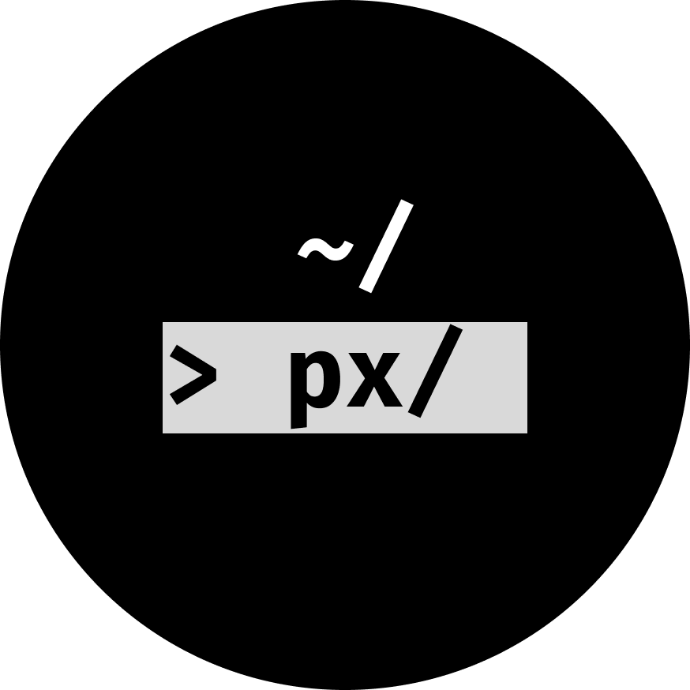

<p align="center">
  

</p>

<h1 align="center">polyxplorer</h1>

<p align="center">
  Clean; quiet.
</p>


## What It Is
- Intended for simple file exploring, changes and deletions with minimal distractions.

## Why?
- polyxplorer aims to decrease the dependence on heavy GUI explorers for simple tasks.
- polyxplorer does not aim to replace GUI (or even other TUI) file explorers.

## How?
- Uses the terminal with raw mode and manual ANSI codes to display a UI onto the terminal.
- Keeps track of your files and the current working directory.
- Uses standard libraries with no other dependencies than Linux.
- Key binds:
  - Key binds are very simple, and are shown in the application UI:
  - `d` - Delete a file (with prompt)
  - `r` - Rename a file (with prompt)
  - `q` - Quit
  - `j` & `k` - Move selection down/up

## Installation:
- Dependencies/prerequisites: Linux
```
git clone https://github.com/Polymorqhism/polyxplorer.git
cd polyxplorer
make
```
- Optionally, `sudo mv build/polyxplorer /usr/bin/px` to use it easier.

---
v1.0.4
- GPL-3.0 license. See LICENSE for more information.
- Full paginal support not added yet, a quick fix is to simply decrease the terminal font size.
- Personal project, large userbase is not intended. Bugs may be reported in the issues tab of this repository.
- No generative LLM used in this project, source code is visible with sources for certain parts of code.